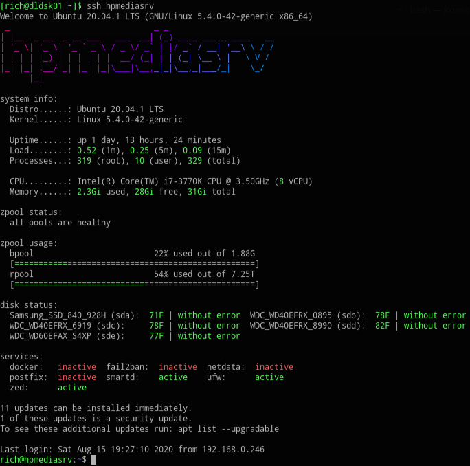
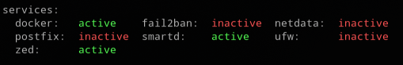

# Ansible Role for Custom Message of the Day (MOTD), Smartmon Tools with ZFS Support

Ansible role used to deploy customized Message of the Day. Dress up your login welcome screen and provide informative information about the status of the system.



---

## TL;DR

* Standard Message of the Day (MOTD) output can be disabled and replaced with enhanced versions.
* HDD/SSD Testing and Testing Schedule (can be customized) will be provided by Smartmon Tools.
* Standardized services lists for all hosts and additional list for specific hosts can be defined.
* Each system login will show you the status of the last device test as well as its current temperature.
* Additional MOTD files are provided and can be enabled, new ones can be added.

---

## Requirements

* SSH Server configured to display message of the day (enabled by default on Ubuntu)
* Ubuntu 22.04 Tested
* Other systems probably work fine, untested. Let me know.

---

## Packages Installed

The following packages will be installed:

* [smartmontools](https://en.wikipedia.org/wiki/Smartmontools) retrieves the S.M.A.R.T. (Selt-Monitoring, Analysis and Reporting Technology) attributes from the disk devices including temperature and performs periodic testing of the disk devices
* [nvme-cli](https://packages.ubuntu.com/search?keywords=nvme-cli) NVM-Express user space tooling for Linux
* [git](https://en.wikipedia.org/wiki/Git) needed to retrieve files from [Custom Message of the Day with ZFS Support](https://github.com/reefland/motd) repository
* [update-motd](http://manpages.ubuntu.com/manpages/focal/man5/update-motd.5.html) is a framework by which `motd` is dynamically assembled from a collection of scripts at login
* [figlet](https://en.wikipedia.org/wiki/FIGlet) to generate the hostname as a larger banner font
* [lolcat](http://manpages.ubuntu.com/manpages/focal/man6/lolcat.6.html) provides a colorful rendering of the `figlet` hostname banner
* [update-notifier-common](https://packages.ubuntu.com/focal/update-notifier-common) provides some of the MOTD scripts required including notification if a reboot is required
* [bsdmainutils](https://launchpad.net/ubuntu/focal/+package/bsdmainutils) provides text parsing utilities ported over from BSD. Utilities such as `column` are used to present disk information.

---

## How Do I Set It Up

### Edit your inventory document

Add something like the following if you use `INI` inventory format:

```ini
[motd_group:vars]
enable_these_motd_files='["10-hostname-color", "20-sysinfo", "30-zpool-bar", "40-services"]'
services_list_override='["fail2ban", "zed", "smartd"]'

[motd_group]
testlinux.example.com more_motd_entries='["60-docker"]' more_services_entries='["docker"]'
```

* The `[motd_group:vars]` block defines variables that will be applied to all systems defined in the group and can override variables defined in `defaults/main.yml`.
  * Variable `enable_these_motd_files=` is optional and specifies which MOTD messages are to be applied to all systems defined in this group.  If not defined here the value in `defaults/main.yml` will be used.
  * Variable `services_list_override=` is optional and specifies which services the service MOTD file will report on. This is applied to all systems defined in this group. If not defined here the value in `defaults/main.yml` will be used.
  * Variable `smartd_email_notification` is an optional comma separated with no spaces list of email addresses for `smartctl` notifications provided you already have a working smtp client configured for system use.
* The `[motd_group]` block lists the hostname(s) that you intent to apply this script to.
  * The variable `more_motd_entries=` is optional and specifies which MOTD messages are unique to that host and not installed on every host.  If not defined here then nothing else will be added to `enable_these_motd_files` list.
  * The variable `more_services_entries=` is optional and specifies which additional services the MOTD service file should report on for the specific host.  If not defined here then nothing else will be added to `services_list_override=` list.

I prefer to use `yaml` format:

```yaml
---
###[ MOTD, SMARTD with ZFS]################################################
motd_group:
  hosts:
    testlinux.example.com:
      more_motd_entries: ["60-docker"]
      more_services_entries: ["docker"]

  vars:
    enable_these_motd_files: ["10-hostname-color", "20-sysinfo", "30-zpool-bar", "40-services"]
    services_list_override: ["fail2ban", "zed", "smartd"]
    smartd_email_notification: "user1@example.com,user2@example.com,..."
```

---

### Review `defaults/main.yml` to define the defaults

The `defaults/main.yml` can be used to configure which default messages (installed by OS) are disabled and which new ones are to be added and enabled.

#### Default Message Files to Disabled

This block defines existing messages which will be disabled by simply removing the execute bit from them:

```yaml
motd_entries:
  # Define Message of the Day items to disable by removing -x from file
  to_disable:
    - "10-help-text"
    - "80-esm"
    - "80-livepatch"
    - "88-esm-announce"
    - "90-updates-available"
    - "91-contract-ua-esm-status"
```

Some older version of Ubuntu used symlinks, this block can unlink them:

```yaml
motd_entries:
  # Define Message of the Day items which need to be unlinked (remove -x does not work)
  to_unlink:
    - "50-landscape-sysinfo"
```

The Ubuntu NEWS is pretty much SPAM:

```yaml
# Display the Ubuntu News Message - 0 = disable, 1 = enable
# value set within: /etc/default/motd-news
show_ubuntu_news_message: '0'
```

### Enhanced Message Files to Enable

The following defines the base set of new message files from the [Custom Message of the Day with ZFS Support](https://github.com/reefland/motd) Repository which will be enabled.  The selected message files are applied to all systems.  Message files to be enabled on specific systems are defined below via the Inventory File.

```yaml
# Define Custom Message of the Day files to ENABLE from the GIT Repo to all hosts
enable_these_motd_files:
  #  - 10-hostname                 # Blah no color hostname
  - 10-hostname-color
  - 20-sysinfo
  #  - 20-uptime                   # Standard uptime message  
  - 30-zpool-bar                # ZFS Usage Graphs
  - 36-diskstatus               # Disks, Temps, Test Results
  - 40-services                 # Status of Services
  #  - 50-fail2ban                 # Fail2ban Summary (standard)
  #  - 50-fail2ban-status          # Fail2ban status per jail
  #  - 60-lxd                      # Status of lxd containers
  #  - 60-docker                   # Status of Deployed Docker Containers
  - 90-updates-available-no-esm # Updated available without ESM or Pro Messages
```

### System Specific Message Files to Enable

Some MOTD message files don't apply to all servers such as LXD or Docker.  To enable these on specific systems you can define it within the inventory file per host via `more_motd_entries` variable:

#### Specific Message File per Host via Inventory File

```ini
[motd_group:vars]
enable_these_motd_files='["10-hostname-color", "20-sysinfo", "30-zpool-bar", "40-services"]'

[motd_group]
testlinux.example.com more_motd_entries='["60-docker"]'
```

To make the list smaller than the base list for a specific host, then just define it for that host such as:

```ini

[motd_group]
testlinux.example.com enable_these_motd_files='["10-hostname-color", "30-zpool-bar"]'
```

---

### Customize Services to Report on

The following defines the base set of services to report status on.  The MOTD repository services file has a hard coded list of services. This section specifically lets you customize this MOTD service list:



The list below will replaced the hard coded services list and will be applied to all systems in this group.  Services to report on for specific systems are defined below via the Inventory File.

```yaml
###[ Message of the day Services overrides ]#######################################################
# The "40-services" service is from another repository with a default set of services to include
# within the Message of the Day screen.  This section to define a set of services to replace
# the services which are hard coded.

services_list_override:
  - "fail2ban"
  - "ufw"
  - "netdata"
  - "zed"
  - "smartd"
  - "postfix"
```

### System Specific Services to Report on

Some services don't apply to all servers such as LXD or Docker.  To enable these on specific systems you can define it within the inventory file per host via `more_services_entries` variable:

#### Specific System Services per Host via Inventory File

```shell
[motd_group:vars]
services_list_override='["fail2ban", "zed", "smartd"]'

[motd_group]
testlinux.example.com more_services_entries='["docker"]'
```

In the example above, host `testlinux.example.com` will then have the 3 base services plus one extra service applied for 4 total services.

#### Adjust Number of Columns to Display

The number of columns to display the services list can be adjusted as needed:

```yaml
# Set the number service columns to display
services_columns_to_display: 4
```

---

## Additional Settings to Review

* Review [Smartmon Testing Settings](docs/smartmon-tests.md)
  * Includes how to view and set testing schedules
* Review [NVME Device Settings](docs/nvme-settings.md)
* Review [Custom Message of the Day with ZFS Support](https://github.com/reefland/motd) repository for more detailed information.

---

## Running the Custom Message of the Day (MOTD) with ZFS Support Playbook

This is an example playbook named `motd-zfs-smartd.yml`:

```yml
- name: Install Custom Message of the Day (MOTD), Smartmon Tools, SMARTmon Node Exporter
  hosts: motd_group
  become: true
  gather_facts: true

  roles:
    - role: motd-zfs-smartd
```

```bash
# Apply playbook to all hosts defined in group
ansible-playbook -i inventory motd-zfs-smartd.yml

# Use Ansible's limit parameter to specify individual hostname to run on:
ansible-playbook -i inventory motd-zfs-smartd.yml -l testlinux.example.com
```

---

## Running Playbook with Tags

The following Ansible Tags can be used to run specific tasks:

* `setup_motd` - Install required packages, perform tasks related to enable / disable configured Message of the Day settings
* `updated_services_motd_file` - Replace the remote services reported with the configured service list
* `setup_smartmontools` - Install required packages, update `smartd.conf` file, restart `smartd` service

```bash
# Apply playbook tag to all hosts defined in group
ansible-playbook -i inventory motd-zfs-smartd.yml --tags="setup_motd"
```
